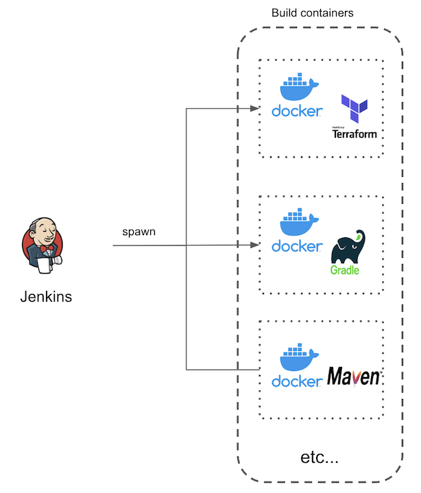

# Microservice - Jenkins-Build-Container

This repository contains a library of different kinds of custom built 'build containers' with specific library/dependencies/runtimes to be used in Jenkins.

## Sypnosis

Rather than using physical or vm 'Agents' in Jenkins directly (as previously commonly done), we can instead spawn off ephemeral 'build containers' to do a _one-off_ build job. These containers are meant to be 'short-lived' and only exist in the lifespan of the build job (pipeline execution).

Minimal library/dependencies/runtime can be baked into the build container docker image. 

No need to configure and install manually those library/dependencies/runtime on the 'Agents' and not require to manage the lifecycle of those agents servers/machines etc.

They would be teared down and discarded once the build job finishes.



## Usage

The custom build containers come supplied as a Docker file for to build a docker image from.

e.g.

```bash
docker build -t terraform-build -f Dockerfile_Terraform .
```

The usage of this custom build containers is that once the Docker image is built, we would reference the built Docker image from the Jenkinsfile (of your project) in the agent section.

e.g.
```groovy
pipeline {
  agent {
    docker {
      image 'terraform-build:latest'
    }
  }
}
```


## Inventory

| Build Container       | Description                                                                       |
| --------------------- | --------------------------------------------------------------------------------- |
| Dockerfile            | 'One size fits all' build containers containing whole host of tools & runtimes    |
| Dockerfile_Gradle     | with just Gradle                                                                  |
| Dockerfile_Node       | with the NodeJS runtime                                                           |
| Dockerfile_Packer     | Packer for building machine images like Amazon AMI                                |
| Dockerfile_Terraform  | Terraform for provisioning infrastructure on various cloud platforms              |
